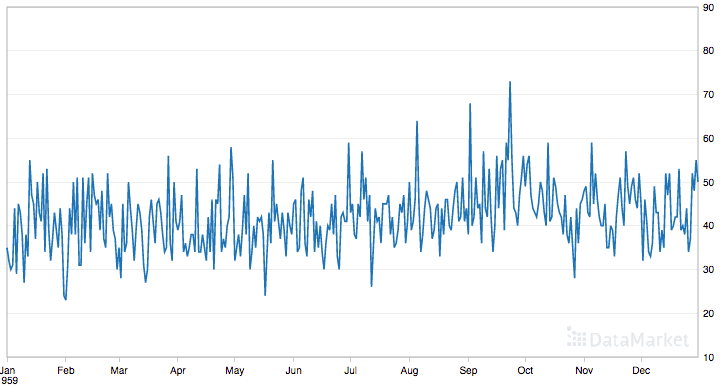
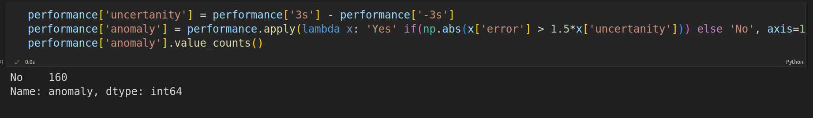

# LSTM_anomaly_detection

Anomaly detection using LSTM.

# Daily Female Births Dataset

This dataset describes the number of daily female births in California in 1959. The units are a count and there are 365 observations. The source of the dataset is credited to Newton (1988).

Below is a plot of the entire dataset.

Dataset has two columns: Date and Births.

# Dataset Scaling and Split

Scaling dataset using MinMaxScaler.

Splitting dataset into train and test sets.

# Transform a time series into a prediction dataset

To do that we will use function create_dataset().

dataset: A numpy array of time series, first dimension is the time steps
lookback: Size of window for prediction

# LSTM Model

Our model will have one LSTM layer with input_size = 1 and hidden_size = 50. And also one fully connected layer with 50 input channels and 1 output channel.

# Training

We will train our model on 2000 epochs and use optimizer Adam and loss function MSE

# Prediction

We will try to make a prediction and plot the results.

# Anomaly Detection

To detect anomalies we need to calculate our model's errors and confidence intervals. If error is bigger than 1.5*(uncertanity) that is anomaly.

In our case all observations are normal.

